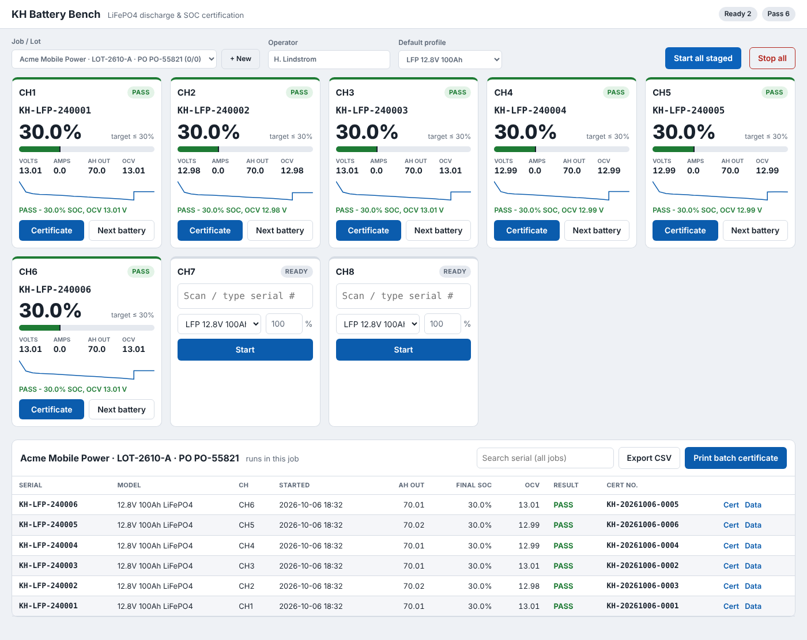

# KH-Battery-Dashboard
Track SOC, serial number and date/time, and print a certificate, all from one tool.

**KH Battery Bench** discharges LiFePO4 batteries to **30% SOC** on many channels in parallel,
logs every run and prints certificates per unit or per customer batch.



---

## How it works

| Step | What happens | Pass/fail gate |
|---|---|---|
| 1. Pre-check | Reads the rested battery voltage with the load OFF | V/cell ≥ `min_start_cell_v` (3.32). Below that the battery isn't full, so the run is rejected |
| 2. Discharge | Constant-current load ON; Ah are integrated from *measured* current every second | Stops when `Ah removed = (start SOC − 30%) × rated Ah`. Safety stops: cutoff voltage, low current, over-temp, timeout |
| 3. Rest | Load OFF for `rest_minutes` (30); voltage is logged | — |
| 4. Verdict | Records rested OCV | Final SOC between 20% and 30%, **and** OCV within 3.18–3.30 V/cell |
| 5. Certificate | PASS gets a unique cert no. `KH-YYYYMMDD-####` | — |

**Why coulomb counting and not voltage:** LiFePO4 voltage is nearly flat from 20–80% SOC
(±0.05 V/cell), so voltage alone can't tell 30% from 50%. The tool counts amp-hours out of
a **fully charged** battery, then uses rested voltage only as a cross-check.
→ **Every battery must come off a full charge.** The pre-check enforces this.

---

## Quick start (demo, no hardware)

```bash
pip install -r requirements.txt
python -m kh_bench
```
Open **http://localhost:8000**. The example config runs 8 simulated channels at 120× speed,
so a full cycle takes about 2 minutes.

## Operating the bench (daily workflow)

1. **New job**: click **+ New** and enter customer, PO and lot. Every battery you run goes on that job's batch cert.
2. **Operator**: type your name once. It's remembered and printed on the cert.
3. **Profile**: pick the battery model in *Default profile*.
4. **Scan serials**: click CH1's serial box and scan. The scanner's Enter jumps to the next empty channel, so scan straight down the line.
5. **Hook up** each battery to its channel's load.
6. **Start all staged**. Each card shows live SOC, V, A, Ah out, ETA and a voltage trace.
7. When a card turns **green (PASS)**: disconnect the battery, click **Next battery**, scan the next one and press **Start**.
8. **Red (FAIL)**: the reason is on the card (not full, hit cutoff, no current…). Fix the problem, recharge and rerun. Failed units never appear on a cert.
9. **Print batch certificate** prints one PDF for the job with every PASS serial. Reprints keep the same cert number.
10. **Export CSV** gives the job summary. **Data** on any row gives that run's full V/I/Ah log.

Re-running a serial that already passed asks for confirmation first, so duplicates don't slip through.

---

## Hooking up real hardware

1. Copy the config: `cp bench_config.example.json bench_config.json`
2. Edit `channels`, one entry per load (or per channel on a mainframe):

```json
{"id": 1, "name": "CH1", "driver": "scpi", "resource": "TCPIP::192.168.1.50::INSTR", "preset": "rigol_dl3000", "max_current_a": 30}
{"id": 2, "name": "CH2", "driver": "scpi", "resource": "USB0::0x1AB1::0x0E11::DL3A000000001::INSTR", "preset": "siglent_sdl1000"}
{"id": 3, "name": "CH3", "driver": "scpi", "resource": "TCPIP::192.168.1.60::INSTR", "preset": "chroma_63600", "load_channel": 1}
```

| Preset | Loads |
|---|---|
| `rigol_dl3000` | Rigol DL3021 / DL3031 |
| `siglent_sdl1000` | Siglent SDL1020X / SDL1030X |
| `bk_8600` | B&K Precision 8600 series |
| `chroma_63600` | Chroma 63600 multi-channel mainframe |

To support another load, add its SCPI commands to `PRESETS` in `kh_bench/drivers/scpi.py`.
Nothing else changes.

3. Set `"time_scale": 1` (or delete it) on real channels.
4. Run `python -m kh_bench`. Any channel that can't connect shows **offline** with the error and a **Reconnect** button.

**Wiring/safety notes**
- Use the load's **remote sense** leads at the battery terminals, or V readings will include lead drop.
- Fuse each battery lead. The tool switches every load OFF on finish, fail, stop and server shutdown, but the hardware fuse is your last line of defense.
- Check each load's power rating: 12.8 V × 25 A ≈ 320 W per channel.

## Battery profiles

Defined in `profiles` in the config. Key fields:

| Field | Default | Meaning |
|---|---|---|
| `rated_ah` | — | Nameplate capacity. SOC % is relative to this |
| `cells_series` | 4 | 4 = 12.8 V, 8 = 25.6 V, 16 = 51.2 V |
| `discharge_a` | — | Discharge current (capped by channel `max_current_a`) |
| `target_soc` | 30 | Stop point |
| `min_final_soc` | 20 | Below this = FAIL (over-discharged) |
| `min_start_cell_v` | 3.32 | Pre-check for "fully charged". Set 0 to disable |
| `cutoff_cell_v` | 2.80 | Safety abort |
| `rest_minutes` | 30 | Rest before the OCV reading |
| `ocv_cell_min/max` | 3.18 / 3.30 | Rested V/cell window at ~30% |

Certificate wording (company name, address, title, statement) lives under `company`.
**Have your compliance/shipping contact review `cert_statement` before using it with customers.**

---

## Project layout

```
kh_bench/
  engine.py        discharge cycle state machine (one async task per channel)
  drivers/         simulated.py, scpi.py (Rigol/Siglent/BK/Chroma), base.py
  soc.py           LiFePO4 OCV table + Ah math
  cert.py          PDF certificates (reportlab)
  db.py            SQLite: jobs, runs, samples  -> data/bench.db
  api.py           REST API + dashboard
  static/          dashboard (vanilla JS, no build step)
tests/             full-cycle tests against the simulator
```

Run the tests with `python -m pytest -q`.

### API (for integrations)
`GET /api/state` · `POST /api/channels/{id}/start|stop|clear|reconnect` ·
`GET|POST /api/jobs` · `GET /api/jobs/{id}/certificate.pdf|report.csv` ·
`GET /api/runs?serial=` · `GET /api/runs/{id}/certificate.pdf|samples.csv`
